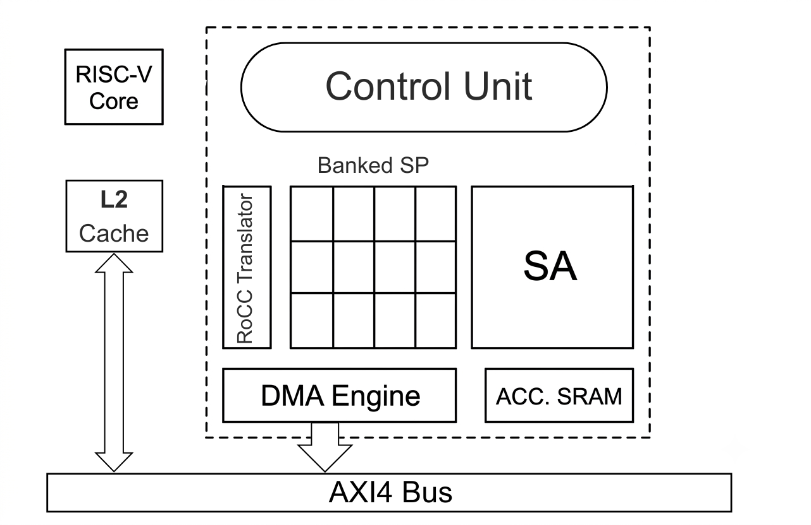

# Systolic Array

This project details the creation of a Systolic Array (**SA**), which will be used in a Artificial Intelligence (**AI**) accelerator for the purposes of my intersnhip at "Universität Bremen".

## Overview

The purpose of this project is to create a fully functional AI accelerator, which will be introduced in ChipYard's framework and will be connected, as a tightly coupled device to a Rocket Core. The efficiency and performance of the finalised accelerator design will be assesed through a series of tests, held within the ChipYard framework.
The designed Systolic Array (**SA**) is implemented using Dot Product Processing Elements (DPPE).

## Description

The AI accelerator, as conceptualised thus far, will feature a Systolic Array (**SA**) comprised of Dot Product Processing Elements (**DPPE**). A banked Scratchpad (**SP**) will be used to store the activations required for processing. An Accumulator SRAM (**Acc. SRAM**) is used to store partial sums as they flow out of the SA and to also perform accumulation when required. An Open-Source AXI4 DMA Engine is used to facilitate the transfer of data between the SP and the L2 Cache of the RISC-V Core. The Control Unit (**CU**) operates as the brain of the accelerator, producing the control signals that flow into the rest of the modules and dictate the flow of data. Lastly, the **RoCC  Translator** is the module that handles the communication between the RISC-V Core and the accelerator. It receives the RoCC interface signals and "translates" them into signals the rest of the modules understand. The main recipient of signals from the RoCC Translator is the CU.

At its current stage, a Concatenation module is also used before the SP. The reason for this is the architecture of the SP itself, which will output a number of bits dependent on four parameters, number of concurrent address reads, number of N rows within the DPPE, number of operators OP and the data width. To facilitate scalability and uniformity throught the different components of the designed accelerator, all parameters like data width, number of DP2s, DPPEs and many more are held in the file named **pe_pkg**. 

The schematic of the current accelerator architecture can be seen in the picture below, the dotted lines seperating the accelerator from its environment.

  

### Systolic Array
The Systolic Array built is currently comprised of the following modules, following a top to bottom view of the system:

**DPPE_SA:** At this is the level a number of MxM DPPEs are connected together, creating the final grid of the SA. 

**DPPE:** Within this module an NxN number of DP2 modules are instantiated. Every DP2 module contains an OP number of weight registers, which results in a N*N\*OP number of weight register at the DPPE level. 
This is also the level that handles the boundary register logic of the SA. In **"Systolic Tensor Array: An Efficient Structured-Sparse GEMM Accelerator for Mobile CNN Inference"** researchers found that by reducing the number of the Processing Elements' (**PE**) boundary buffers they can achieve area and power gains up to 2x. Following this example my designed DPPE is parametrasible and boundary registers are the designer's choice. 

**DP2:** This module is a fully combinational circuit, meant to hanlde just the MAC operations of the SA. Depending on the application and the designer's preference, this module can handle an OP number of operands at once.

### Memory Components

**Accumulator SRAM:** When the size of the SA is smaller than the size of the matrices being processed, then the need for this module arises. It holds the resulting partial sums coming out of the SA and outputs the result when there is one.

**DMA:** The Direct Memory Acces module is a hardware subsystem that enables peripherals or processors to transfer data directly to or from memory without involving the CPU. This offloads data movement tasks from the processor, improving system performance and efficiency.

**Banked Scratchpad:** Stores the activations that the SA will require for processing and is comprised of a number of SRAM modules. Unlike a standard L1 or L2 cache this scratchpad has all the activations required preloaded, before the computing from the SA begins. This way cache misses, which spike latency during computation, are avoided. It is partitioned into P number of banks, facilitating improved memory utilisation.  

**SRAM:** This is a standard signle port RAM.

**Double Buffer:** The Double Buffer or Ping-Pong Buffer as is it called, is a module consisting of two single port RAMs. It has two states and its name comes from the fact that in the first state data is written into the first RAM while data is read from the second one. Likewise, in the second state the RAMs switch roles allowing the module to act as a dual port RAM with concurrent read and write.

**Concatenation module:** Despite not being a memory element itself, this module belongs in this file since its only use is concatenating incoming activation data and feeding them to the SP. 

## Supervisor

Alberto Garcia-Ortiz, Head of Chair for Microelectronics at the University of Bremen 

## Guidance

Sebastian Fischer, Scientific Assistant/Ph.D. Candidate